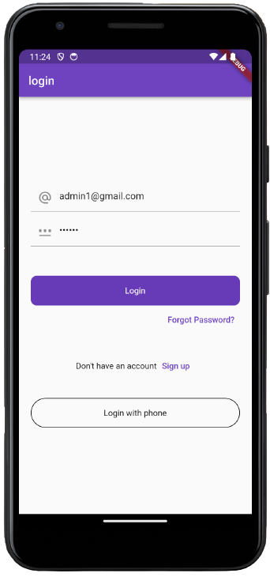

# Firebase App

A mobile app leveraging Firebase for user authentication, storage, and realtime database.

## Screenshots

  

## Features

- User registration and login with Firebase Authentication
- Image upload and storage using Firebase Storage  
- Realtime data syncing across clients with Firebase Realtime Database

## Built With

- [Flutter](https://flutter.dev/) - Beautiful native apps in record time  
- [Firebase](https://firebase.google.com/) - Backend-as-a-Service for mobile applications
- [Cupertino_icons](https://apps.apple.com/us/app/cupertino-catalog/id1665329294) - Set of widgets implementing the current iOS design language
- [Firebase_core](https://pub.dev/packages/firebase_core) - A Flutter plugin to use the Firebase Core API
- [Firebase_storage](https://pub.dev/packages/firebase_storage) - A Flutter plugin to use the Firebase Cloud Storage API
- [Firebase_auth](https://pub.dev/packages/firebase_auth) - A Flutter plugin to use the Firebase Authentication API
- [Cloud_firestore](https://pub.dev/packages/cloud_firestore) - Flutter plugin for Cloud Firestore, a cloud-hosted, noSQL database with live synchronization and offline support on Android and iOS
- [Fluttertoast](https://pub.dev/packages/fluttertoast) - Toast Library for Flutter, Easily create toast messages in single line of code
- [Firebase_database](https://pub.dev/packages/firebase_database) - Flutter plugin for Firebase Database, a cloud-hosted NoSQL database with realtime data syncing across Android and iOS clients, and offline access
- [Image_picker](https://pub.dev/packages/image_picker) - Flutter plugin for selecting images from the Android and iOS image library, and taking new pictures with the camera.

## Getting Started

### Prerequisites

- Flutter SDK
- Any IDE with Flutter plugin installed (VSCode, Android Studio etc)

### Installation

1. Clone the repo

   ```
   git clone https://github.com/<yousufmyk>/firebase-app.git
   ```

2. Install dependencies

   ```
   flutter pub get
   ```
 . Install dependencies for IOS

   ```
   cd ios
   ```
   ```
   pod update
   ```

3. Run the app

   ```
   flutter run
   ```
   
## Testing

- Unit tests - `flutter test test/*.dart` 

## Contributing

Contributions are welcome! Please read [CONTRIBUTING.md](CONTRIBUTING.md) for guidelines.

## License

This project is licensed under the MIT License - see the [LICENSE](LICENSE) file for details.

---

Made with ❤️ by [Your Name]
